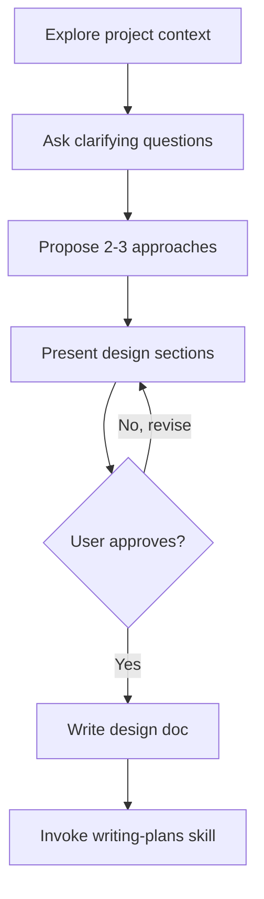

# Brainstorming Ideas Into Designs

## When to use this skill
- User says "let's brainstorm", "I have an idea", or "how should we build..."
- User wants to explore approaches before writing code
- Starting any new feature, module, or significant change
- User describes a problem but hasn't decided on a solution yet

## Hard Gate

> **DO NOT** write any code, scaffold any project, or take any implementation action until you have presented a design and the user has approved it. This applies to EVERY project regardless of perceived simplicity.

## Anti-Pattern: "This Is Too Simple To Need A Design"

Every project goes through this process. A single utility, a config change, a quick feature — all of them. "Simple" projects are where unexamined assumptions cause the most wasted work. The design can be short (a few sentences for truly simple projects), but you MUST present it and get approval.

## Checklist

- [ ] **Explore project context** — check files, docs, recent changes
- [ ] **Ask clarifying questions** — one at a time, understand purpose/constraints/success criteria
- [ ] **Propose 2-3 approaches** — with trade-offs and your recommendation
- [ ] **Present design** — in sections scaled to complexity, get user approval per section
- [ ] **Write design doc** — save and share with user
- [ ] **Transition to planning** — invoke writing-plans skill to create implementation plan

## Process Flow

## The Process

### 1. Understanding the idea
- Check the current project state first (files, docs, recent changes)
- Ask questions **one at a time** to refine the idea
- Prefer multiple-choice questions when possible, but open-ended is fine too
- Only one question per message — if a topic needs more exploration, break it into multiple questions
- Focus on understanding: **purpose**, **constraints**, **success criteria**

### 2. Exploring approaches
- Propose **2-3 different approaches** with trade-offs
- Present options conversationally with your recommendation and reasoning
- **Lead with your recommended option** and explain why

### 3. Presenting the design
- Once you believe you understand what you're building, present the design
- Scale each section to its complexity: a few sentences if straightforward, up to 200-300 words if nuanced
- **Ask after each section** whether it looks right so far
- Cover: architecture, components, data flow, error handling, testing
- Be ready to go back and clarify if something doesn't make sense

## After the Design

### Documentation
- Write the validated design as an implementation plan artifact
- Keep it concise but complete

### Implementation
- Transition to the **writing-plans** skill to create a detailed implementation plan
- Do NOT jump straight into code. Planning is the next step.

## Key Principles

- **One question at a time** — Don't overwhelm with multiple questions
- **Multiple choice preferred** — Easier to answer than open-ended
- **YAGNI ruthlessly** — Remove unnecessary features from all designs
- **Explore alternatives** — Always propose 2-3 approaches before settling
- **Incremental validation** — Present design, get approval before moving on
- **Be flexible** — Go back and clarify when something doesn't make sense
